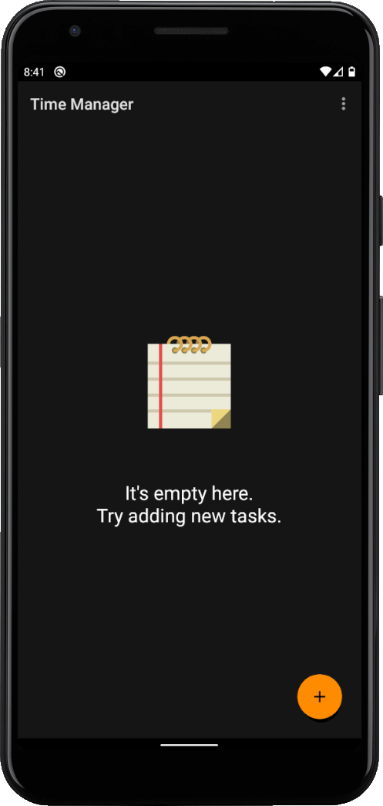
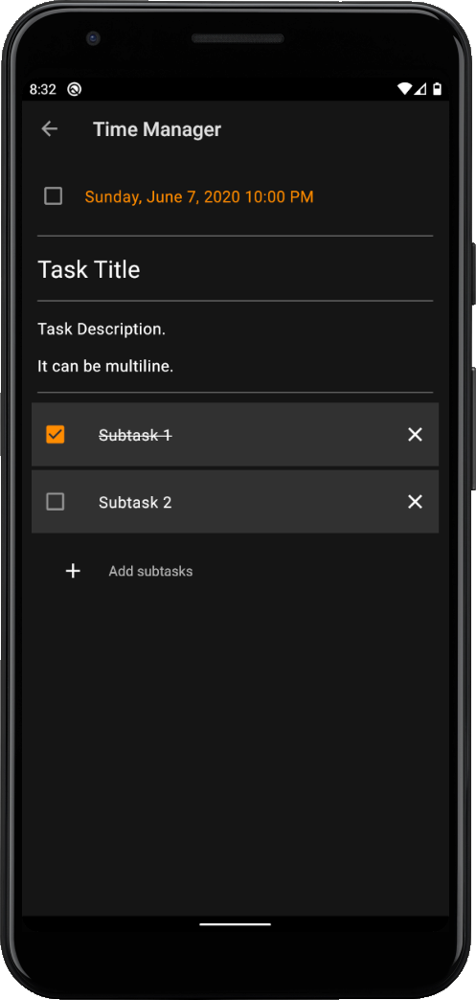
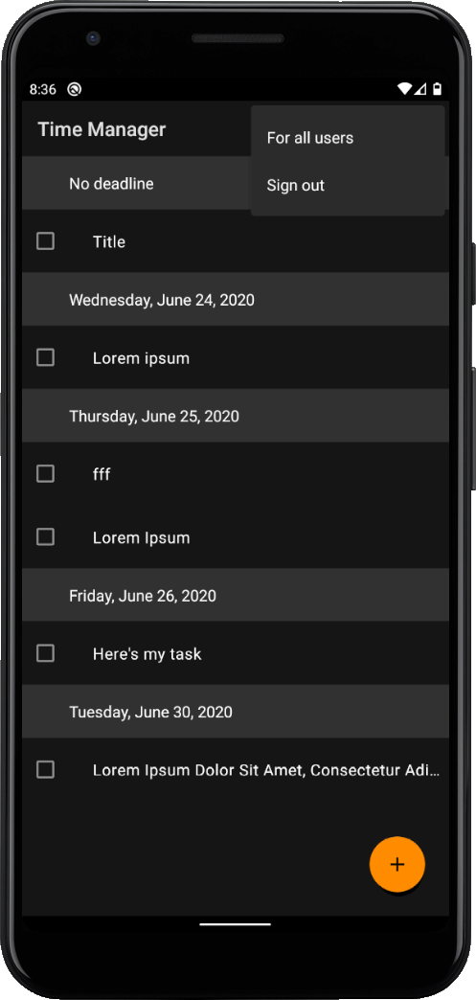

Time Manager
===========

A small app for managing tasks. 

### Features

- set a **deadline** on each task along with **description** & **subtasks**
- tasks are sorted based on deadline
- all tasks are synced to the **cloud**, so you can share them between different devices and never care about loosing important notes
- **login** with Google or email
- view **tasks of other users** (no editing). Why? Because we were told to implement that.

### Implementation details

Internally, Time Manager uses **Firebase Auth** & **Firestore**,
so the app can't work on devices without Google Mobile Services.

### Screenshots






### License

```
Copyright 2020 Oleksandr Bezushko and Kratiuk Mykhailo

Licensed under the Apache License, Version 2.0 (the "License");
you may not use this file except in compliance with the License.
You may obtain a copy of the License at

    http://www.apache.org/licenses/LICENSE-2.0

Unless required by applicable law or agreed to in writing, software
distributed under the License is distributed on an "AS IS" BASIS,
WITHOUT WARRANTIES OR CONDITIONS OF ANY KIND, either express or implied.
See the License for the specific language governing permissions and
limitations under the License.
```
